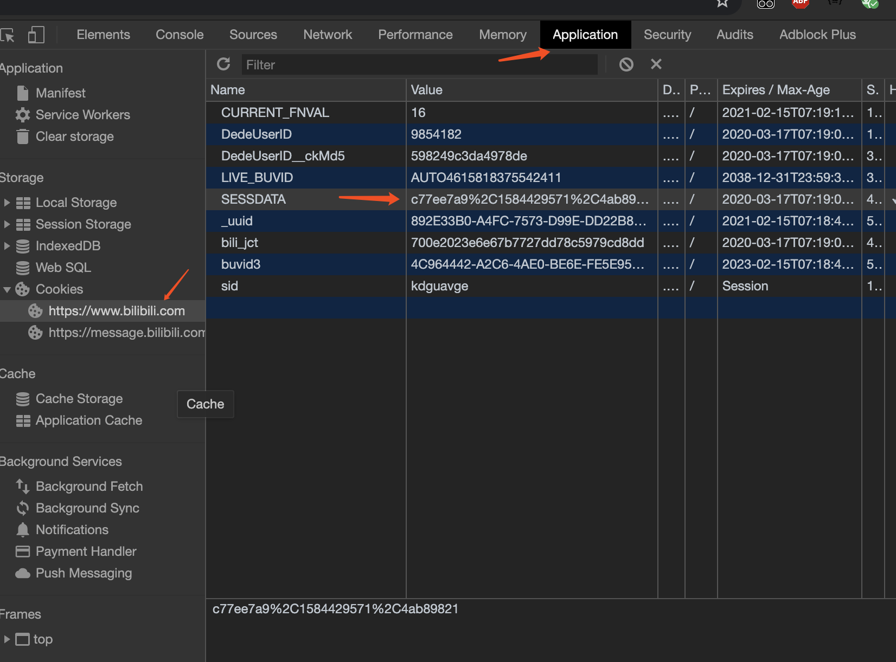
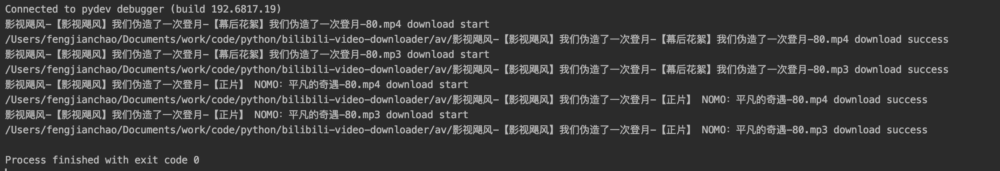

# bilibili Video Downloader
a open-source bilibili video download project

[](https://travis-ci.org/SCUTJcfeng/bilibiliVideoDownloader)

## 说明
支持按 `Up` 下载和按 `av` 号下载

## 例子
要下载凉风所有阅片无数的视频
```python
# up id，比如凉风 14110780
UP_ID = 14110780

# 关键词，如 KEYWORD = '阅片无数' 查看所有带有阅片无数标题的视频
KEYWORD = '阅片无数'

# 视频顺序，关联 up id 和 keyword，默认 pubdate，可选 最新发布 pubdate 和 最多播放 click、最多收藏 stow
ORDER = 'pubdate'
```

## requirement
1. Python >= 3.6
2. `pip install pipenv` 安装 `pipenv`

## 配置
1. 复制 `config.py` 为 `config_local.py`，在 `config_local.py`中修改配置
2. `SESSION_DATA` 在登录状态下的网页 cookies 字段中获取（F12-Application），如图所示


## 运行
1. `pipenv install`
2. `pipenv run python run.py`

## 输出


## 补充说明

未开通大会员的最高只有 1080p 下载，未填写 `SESSION_DATA` 配置的最高只有 480p 下载

### 清晰度
1. 所有下载的视频文件的文件名都有清晰度的说明如112, 80, 64, 32, 16分别对应网页上的清晰度1080p+，1080p，720p，480p，360p
2. 另外 mp4 、mp3格式(如av60005360)对应 m4s，特点是音视频分离，可使用 `FFmpeg` 或其它视频编辑工具合并
